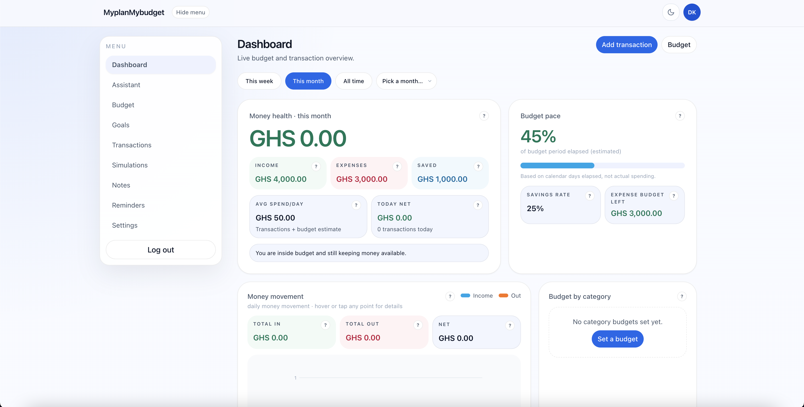
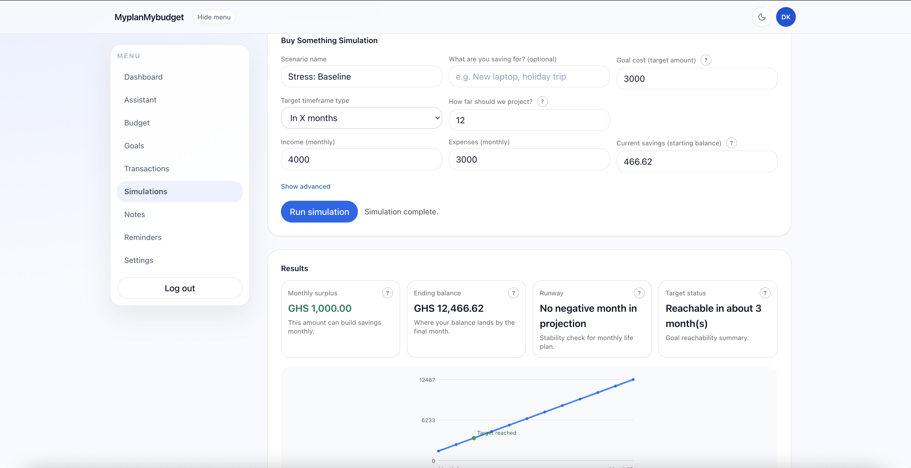
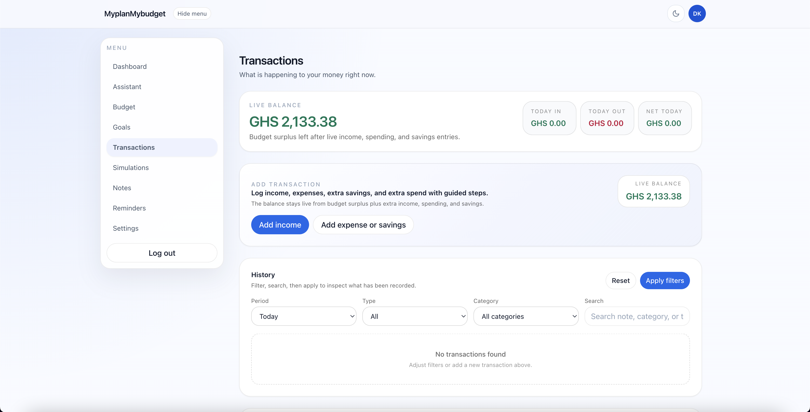
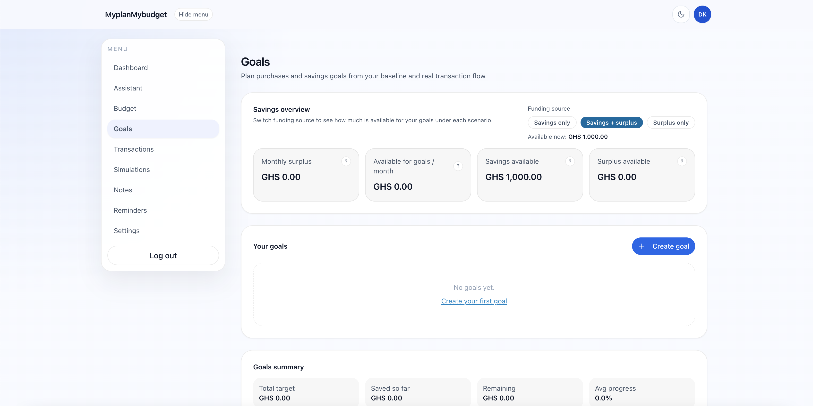

# MyPlanMyBudget

A personal money management app for tracking income, expenses, budgets, savings goals, and financial planning.

## Overview

MyPlanMyBudget is a portfolio demo project built to help users organize their personal finances from a clean dashboard. The app focuses on budgeting, spending awareness, savings planning, transaction tracking, reminders, notes, account settings, and simple financial decision support.

The goal is to make personal money management easier by giving users a structured way to see where money comes from, where it goes, and what plan they should follow.

## Features

- Dashboard overview
- Income tracking
- Expense tracking
- Budget categories
- Savings goals
- Spending summaries
- Transaction history
- Search and filtering
- Notes and reminders
- Account and security settings
- Responsive UI
- Form validation
- Personal finance planning workflow

## Tech Stack

- Next.js
- React
- TypeScript
- Tailwind CSS
- Prisma
- PostgreSQL-compatible database
- NextAuth
- Node.js API routes and server actions
- Playwright and Node test runner
- GitHub
- Vercel

## Screenshots

Screenshots should be added inside:

```txt
public/screenshots
```

Expected screenshots:

```txt
dashboard.png
budget.png
transactions.png
goals.png
```

### Dashboard



### Budget



### Transactions



### Goals



## What This Project Proves

This project shows my ability to build practical user-focused applications with dashboards, forms, state management, data organization, responsive UI, authentication flows, and real-world personal finance workflows.

It demonstrates that I can design and build apps that are useful beyond static pages.

## Getting Started

Install dependencies:

```bash
pnpm install
```

Run the development server:

```bash
pnpm run dev
```

Open the local app in your browser:

```txt
http://localhost:3000
```

## Environment Variables

See `.env.example`.

Do not commit real `.env` files.

## Deployment

This project can be deployed on Vercel after setting the required environment variables from `.env.example`.

Use demo data only for public deployments. Do not connect this public portfolio version to a private production database or real personal finance records.

## Note

This is a cleaned public portfolio version of a private/local project. It is prepared to demonstrate the app structure, features, UI, and implementation approach.

## Status

Portfolio demo project for full-stack freelance work, frontend development, dashboard UI, and AI/coding evaluation gig applications.
